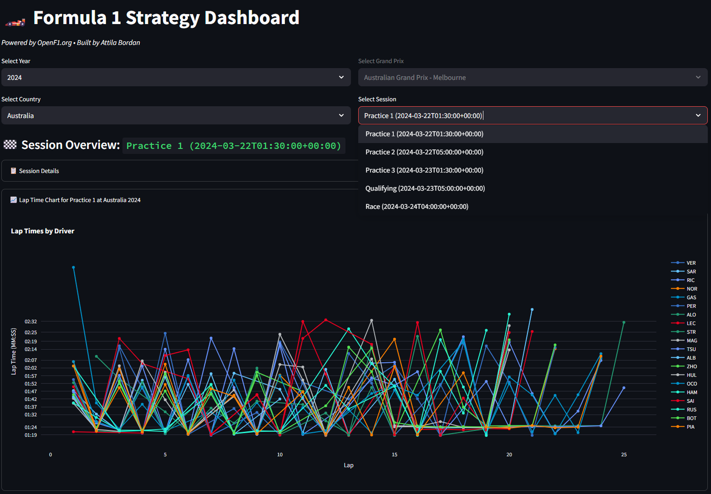
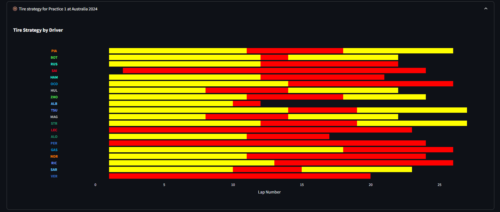
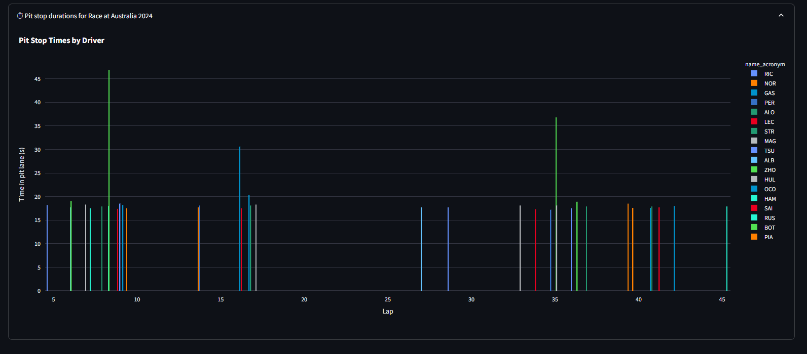

# OpenF1 API: Interactive Strategy Dashboard Tutorial with Streamlit & Plotly

Welcome to this tutorial, where you'll learn to build an interactive Formula 1 strategy dashboard using the OpenF1 API, Streamlit, and Plotly. This hands-on project is ideal for those interested in data visualization, sports analytics, and modern Python web tools.

## 📊 Overview

This dashboard enables users to:
- Select a race by year and country (defaults to 2025 Austin F1 race)
- View lap times per driver with pit stop flags
- Analyze tire strategy over the race distance
- Compare pit stop durations
- **🤖 AI-Powered Lap Analysis**: Get Gemini AI insights on driver performance, lap strategy, and race events

### Technologies used:
- **OpenF1 API** for motorsport telemetry data
- **Google Gemini 2.5** for AI-powered lap analysis
- **Pandas** for data handling
- **Plotly** for interactive charts
- **Streamlit** for web UI  

---

## 📁 Project Structure

```
F1/
├── app/
│   ├── data_loader.py        # Handles OpenF1 API requests
│   ├── data_processor.py     # Cleans and enriches OpenF1 data
│   ├── visualizer.py         # Builds interactive visualizations from OpenF1 data
│   └── lap_analyzer.py       # AI-powered lap analysis with Gemini
├── main.py                   # Streamlit app entry point
├── requirements.txt          # Python dependencies
├── .env                      # Contains BASE_API_URL and GEMINI_API_KEY
├── CLAUDE.md                 # Architecture documentation
└── GEMINI_SETUP.md          # Gemini API configuration guide
```

---

## 📸 Screenshot





## 🛠️ Setup & Requirements

### 1. Clone and navigate to project
```bash
git clone https://github.com/Garyxue213/F1.git
cd F1
```

### 2. Create and activate a virtual environment
```bash
python3 -m venv venv
source venv/bin/activate  # On Windows: venv\Scripts\activate
```

### 3. Install all dependencies from requirements.txt
```bash
pip install -r requirements.txt
```

### 4. Create a `.env` file in the project root
```
BASE_API_URL=https://api.openf1.org/v1/
GEMINI_API_KEY=your_gemini_api_key_here
```

**Note:** Get your free Gemini API key at [https://aistudio.google.com/app/apikey](https://aistudio.google.com/app/apikey)

---

## 🚀 Launch the App

```bash
streamlit run main.py --server.port 3000
```

Then open your browser and go to:
```
http://localhost:3000
```

The dashboard will open with the 2025 Austin F1 race pre-selected. Scroll down to the **"🤖 Simulation Visualizer"** section to see AI-powered lap analysis!

---

### 3. 📂 main.py Highlights

#### Features:

Dynamic year/country selection

Granular session data filtering

Lap time, tire strategy, and pit stop visualizations

#### Key Flow:

Fetch meeting/session info via data_loader.py

Process raw data in data_processor.py

Visualize with plot_lap_times(), plot_tire_strategy(), plot_pit_stop() from visualizer.py

##### Inline comments in the code guide you through OpenF1 endpoint usage:

meetings returns all races in a season

sessions returns FP1, Quali, Race for a given race (meeting_key)

laps, pit, stints, and drivers use session_key to pull telemetry data


### 4 🔍 File Descriptions
```bash
data_loader.py
```
Handles OpenF1 API calls using requests, with optional pagination logic. Each fetch function:

Specifies the OpenF1 endpoint (e.g., "laps", "drivers")

Applies query filters (like session_key or meeting_key)

Uses @st.cache_data to reduce network calls
```bash
data_processor.py
```
Cleans and formats raw OpenF1 data:

Filters invalid lap or pit rows

Calculates stint lap ranges from lap_start to lap_end

Builds a driver_color_map from drivers.team_colour to use in plots
```bash
visualizer.py
```
Creates interactive charts:

plot_lap_times(): line chart of lap_duration colored by driver

plot_tire_strategy(): horizontal bar chart from stints

plot_pit_stop(): vertical bar chart for pit_duration

All charts format hover templates and colors using OpenF1 data fields.

---

## 💡 Extend This Project

Ideas to build on:
- Add tire degradation trends
- Compare qualifying vs. race pace
- Highlight fastest laps and race events
- Integrate sector time analytics

---

## 🎉 Conclusion

You've now built an interactive F1 dashboard using real-world telemetry data from the OpenF1 API. This is a great example of combining API usage, data processing, and visual storytelling in Python.

Fork it, share it, or showcase it in your portfolio!
